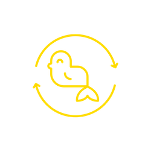

 

# Gold Seal

Dockerized application consisting of a UI and API layer developed using Sinatra.

# Installation

Requires:  
* Docker Engine 19.0.3
* Docker Compose 1.25.4

Optional
* WeaveWorks Scope (https://www.weave.works/oss/scope/)

# Configuration

  In the api folder, create a config.env file that contains the following line:
  
  JIRA=BASE_URL 
  CONFLUENCE=www.someurl (do not include https:// or the path)
  
  where BASE_URL is the url of your JIRA before the /rest/api/latest/
# To Run

docker-compose up --build

# Quick Test

To add a JIRA Story To, you can make an api call as follows:

curl --location --request POST 'localhost:8080/stories/{{ JIRA KEY }}' \
--header 'Content-Type: text/plain' \
--data-raw '{
	"email": "{{ email address }}",
	"password": "{{ password }}"
}'

To view the web page, visit http://localhost:8081